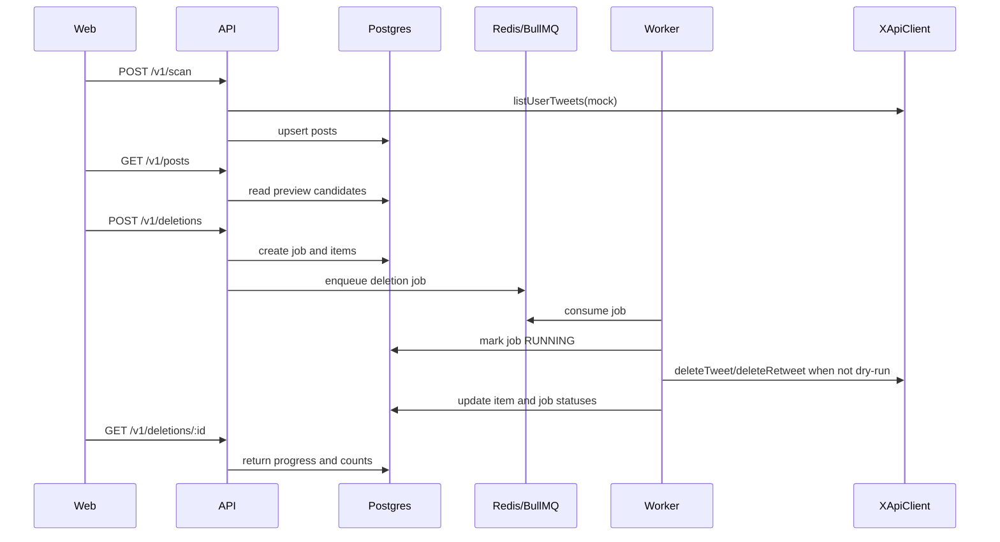

# Architecture

X Account Cleaner is a portfolio-grade MVP scaffold for a privacy-first account cleanup workflow. It is mock-first locally and keeps real X API behavior behind a client abstraction.

## Components

- `apps/web`: Next.js app for dashboard, preview, confirmation, job progress, and exports.
- `apps/api`: Fastify API for OAuth/PKCE scaffold, scans, deletion job creation, progress, and exports.
- `apps/worker`: BullMQ worker for deletion job processing.
- `packages/shared`: shared enums, DTOs, and validation schemas.
- `packages/crypto`: AES-256-GCM encryption and log redaction helpers.
- `packages/x-client`: `XApiClient` interface, mock client, and real-client skeleton.
- `prisma`: PostgreSQL models for users, tokens, posts, jobs, job items, and audit logs.
- `infra`: local Postgres and Redis.

## Flow

## Data Model

Core Prisma models:

- `User`: local user row keyed to `xUserId`.
- `XAuthSession`: short-lived encrypted PKCE verifier state.
- `XToken`: encrypted access/refresh token payloads.
- `Post`: scanned or imported post candidate.
- `DeletionJob`: parent dry-run or deletion job.
- `DeletionJobItem`: per-post work item and status.
- `AuditLog`: sensitive-operation audit trail.

Important enums include `PostSource`, `PostType`, `DeletionJobStatus`, and `DeletionItemStatus`.

## Worker Guarantees

- Dry-run jobs do not call X delete methods.
- Finalized items are skipped on retry.
- `404` from delete is treated as `DELETED_ALREADY`.
- `429` stores `WAITING_RATE_LIMIT` and delays queue retry based on reset time.
- Parent jobs complete as `COMPLETED`, `PARTIALLY_FAILED`, or `FAILED`.

## Real X Boundary

The real X client is intentionally skeleton-level. Future production integration should be added behind `XApiClient` without changing API, worker, or UI contracts more than necessary.
